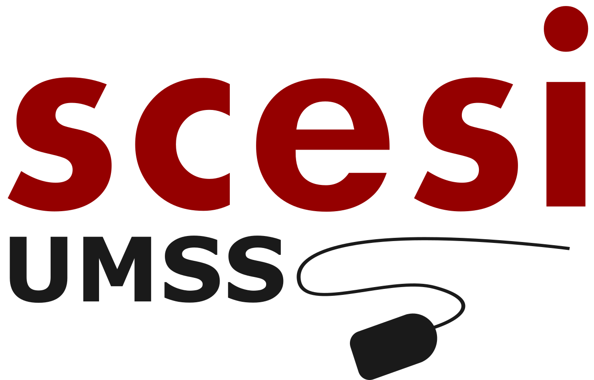

# Práctica Git - Soluciones CSES

   

Este proyecto colaborativo tiene como objetivo resolver problemas del [CSES Problem Set](https://cses.fi/problemset/) utilizando C++.  
Tambien tiene como objetivo poner en práctica todo lo aprendido en nuestro curso de **Git** como parte del proceso de postulación a la **Sociedad Científica (SCESI)**.

   

Cada integrante desarrolla su solución en su propia rama y sigue el flujo de trabajo **GitHub Flow**, aplicando buenas prácticas en el uso de **Git y GitHub**.

## Colaboradores
[@Miguel Angel Condori](https://github.com/Chambeador)  
**Problema:** [Ferris Wheel](https://cses.fi/problemset/task/1090)  
**Descripción:** Organizar niños en góndolas con el mínimo número posible, emparejando los más ligeros con los más pesados.  
**Solución:** Implementación de dos punteros tras ordenar los pesos para optimizar el uso de góndolas.  
**Lenguaje:** C++  

[@usuario2](https://github.com/Del-Mai)  

[@usuario2](https://github.com/r4ccy)  

[@usuario2](https://github.com/TheArrick)  

### Buenas prácticas aplicadas

Durante el desarrollo del proyecto seguimos buenas prácticas de trabajo colaborativo con Git y GitHub:

- Creamos una rama por cada colaborador (`feature/nombre-problema-a-resolver`)
- Escribimos mensajes de commit claros usando el [conventional commit](https://www.conventionalcommits.org/en/v1.0.0/) (`feat`, `fix`, `docs`, etc.)
- Usamos Pull Requests para integrar soluciones, permitiendo revisión entre el equipo
- Mantenemos el repositorio actualizado para evitar conflictos

### Resumen del trabajo en equipo

Esta práctica nos permitió aplicar lo aprendido sobre Git y GitHub en un entorno real de colaboración.  
Algunas reflexiones del grupo:

- **Lo que más nos costó:** Resolver conflictos al hacer `pull`, entender bien cómo funciona el `fetch` y manejar los errores.
- **Lo que aprendimos:** A trabajar con ramas sin cometer errores entre nosotros, usar bien los mensajes de commit, y entender la importancia de los Pull Requests.
- **Trabajo en equipo:** Coordinamos quién resolvía qué problema, revisamos el código de los demás y aprendimos a colaborar de forma ordenada.
- **GitHub Flow:** Fue clave para mantener un flujo de trabajo simple, entendible y controlado.

---

### Gracias a las competencias ICPC 💻 

   

Este proyecto no solo nos permitió mejorar nuestras habilidades en Git y poner aprueba todo lo aprendido, sino también a practicar con problemas similares a los de las **competencias ICPC**.  
Cada desafío nos ayudó a mejorar nuestra colaboración como equipo y mejorar nuestra comunicacion, tambien en la resolución de conflictos y trabajo en equipo, mientras nos preparamos para futuros retos.A seguir aprendiendo y creciendo!. 

